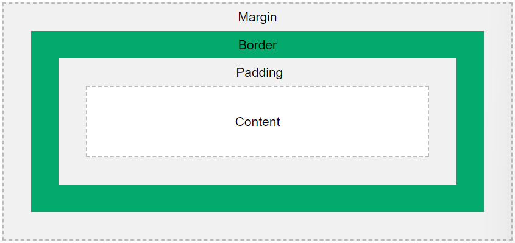

# Explain using code examples what is meant by props and state in React JS?
Props (properties) is a concept used in ReactJS to pass properties between components (i.e., Parent to child).
The child component cannot modify the props but only receive and send them, whereas the parent can send and modify.

This concept can be useful for passing data in page-to-page or page-to-component etc.

```JavaScript
// Import the child component
import ChildComponent from './ChildComponent';

// Parent component
const ParentComponent = () => {
    // Declare the prop data
    const data = "Hi I'm the parent!";

    // Render
    return (
        <div>
            {/* Pass the data as a prop to the Child Component*/}
            <ChildComponent message={data} />
        </div>
    );
};

// Child Component receiving props
const ChildComponent = (props) => {
    return (
        <div>
            {/* Display the value of the passed prop */}
            <p>{props.message}</p>
        </div>
    );
};
```

State is a concept in ReactJS used to store and manage data of a component. Data stored in states are mutable, and changes when a component is re-rendered.

```JavaScript
// import useState 
import React, { useState } from 'react';


const Counter = () => {
    // Declare state variable, give initial value of 0
    const [count, setCount] = useState(0);

    const increment = () =>{
        // Update the state value
        setCount(count + 1);
    };

    return ( 
        <div>
            {/* Render the current value of the state */}
            <p>Current count: {count}</p>   

            {/* Button component to call an increment to change the value of the state */}
            <button onClick={increment}>Increment</button>
        </div>
    );
};
```

The difference between a prop and a state is a prop is used for passing data in between components and state is used for managing and updating data within a component.

# In functional programming, what does the term functor mean? Give an example in JavaScript?
A functor is an object or data structure that implements the `map()` function. Within the function, every operation(s) is applied to every element inside the functor, while still preserving the structure. In this way, computations are performed on every values within a context (e.g., array, list, etc).

```javascript
// Array functor with map() method
const arrayFunc = {
    values: [1, 2, 3, 4],

    // map() function
    map: function (fn) {
        return {
            values: this.values.map(fn),
            map: this.map   // Retain for chaining
        }
    };
};

// Method to double passed element
const double = (x) => x * 2;

// Use the arrayFunc to apply the double() to each element
const doubleArrayFunc = arrayFunc.map(double);

console.log(arrayFunc.values);          // This outputs [1, 2, 3, 4]
console.log(doubledArrayFunc.values);   // This outputs [2, 4, 6, 8]
```

# Mention one advantage and one disadvantage of callbacks, promises and streams.

## Callbacks
Advantage:
Easy to understand.

Disadvantage:
Nesting multiple callbacks can result to the 'Pyramid of Doom', making the code harder to read and maintain.

## Promises
Advantage:
Allows implementation of `then` and `catch` methods on asynchronous operations. This mitigates the 'Pyramid of Doom' and makes the code more readable.

Disadvantage:
Promises are not supported in all browsers, a polyfill may need to be implemented so that they can be used in older browsers.

## Streams
Advantage:
Streams are efficient in processing large datasets because it can handle data in chunks rather than loading it all at once. Using streams can reduce memory consumption and enforce better performance in the system.

Disadvantage:
It is known for having a steep learning curve compared to the other concepts such as callbacks and promises. A fundamental understanding of the concept of streams and pipe operations could be harder to acheive for new developers.

# With the aid of a diagram and example code, describe the CSS Box model and show how it can be used to space DOM elements.
The CSS box model states the design and layout of a box within an HTML element. It consists of the content within the box, the padding between the context and the border, the border itself and the margin encompassing the box.


[Diagram from w3schools.com](https://www.w3schools.com/css/css_boxmodel.asp)

Sample HTML:
```html
<body>
    <h1> CSS Box Model </h1>
    <p>
        The space between the content and the border is the <b>Padding</b>. <br />
        The line encompassing the content and the padding forming the 'box' is the <b>Border</b>. <br />
        The space surrounding the border that separates other component/content from the box itself is the <b>Margin</b>. <br />
    </p>
    <div class="box">
        <h3>Content</h3>
    </div>
</body>
```

Sample CSS:
```css
.box {
    width: 300px;
    border: 15px solid rgb(11, 9, 116);
    padding: 50px;
    margin: 20px;
}

.box h3 {
    text-align: center;
}
```

# Detail how the browser loads and bootstraps a rich web application from an initial URL.

The space between the content and the border is the <b>Padding</b>.
The line encompassing the content and the padding forming the 'box' is the <b>Border</b>.
The space surrounding the border that separates other component/content from the box itself is the <b>Margin</b>.

The margin allows space to be rendered between the box and other DOM elements.

1. User enters the URL into the browser.
The user enters a URL into the address bar/clicks a link. Then the browser sends a request to the server with the provided link.

2. Domain Name System (DNS) navigation/resolution.
If the provided link is not cached, the browser then obtains the IP address of the server by performing a DNS lookup.

3. HTTP request.
Using the obtained IP address of the server, the browser then sends an HTTP request, giving the URL and any other additional information.

4. Server processing.
The server receives the request and generates an HTTP response. This response include the assets such as HTML, CSS, JavaScript.

5. HTML parsing and CSS & JS load and parsing.
The browser receives this response and starts parsing the HTML content and identifies the other asstes.

While the browser parses the HTML, it will encounter any indication of external stylesheets within the HTML:

```HTML
<link rel="stylesheet" href="..."> 
```

Or other assets such as scripts:

```HTML
<script src="..."/>
```

6. Rendering.
As the assets are loaded, the browser constructs the Document Object Model (DOM) and the CSS.

7. JavaScript.
Loaded scripts may contain modification on the DOM or the CSS.
